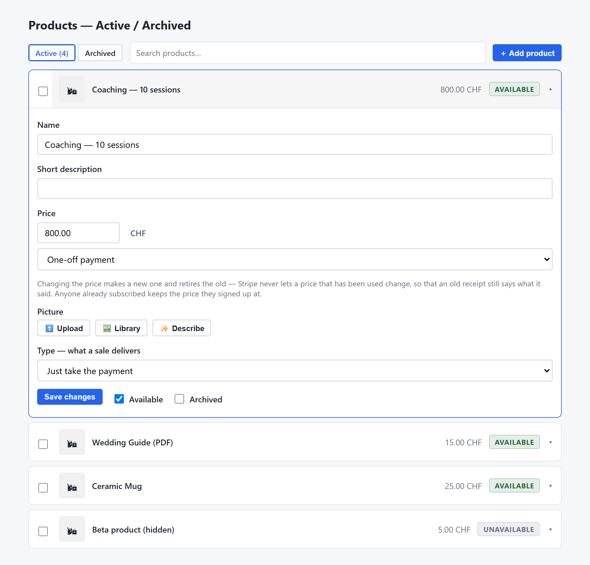
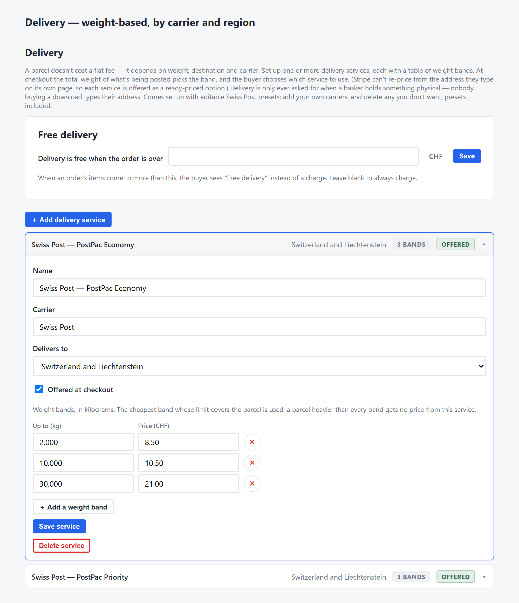
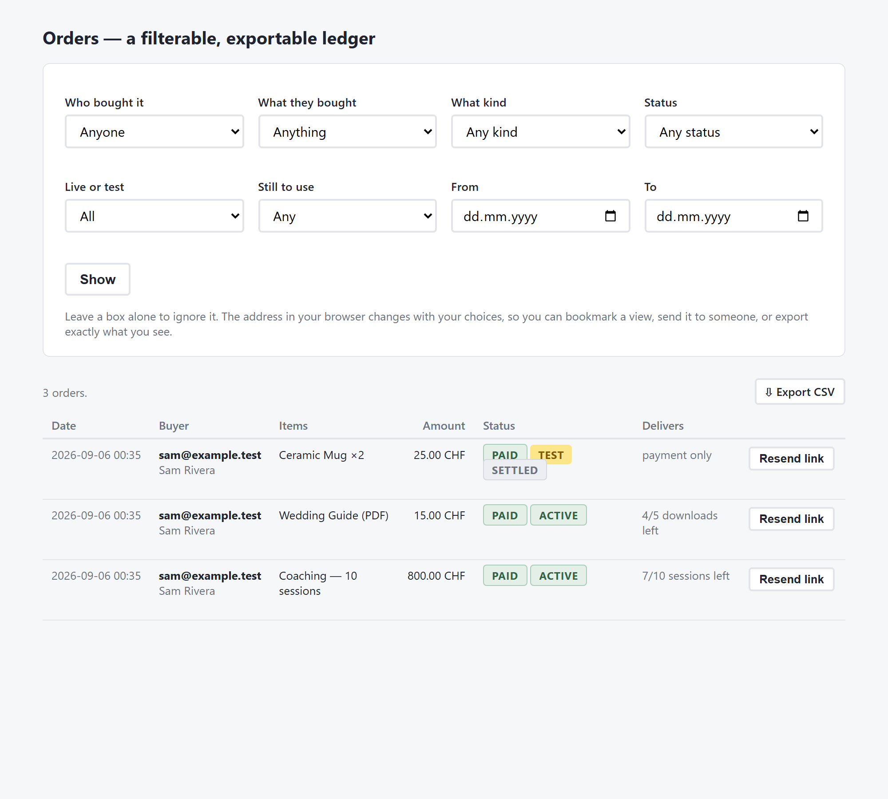

# gmsCms — a self-hosted website builder

A simple, single-site content management system you run yourself. You build
your site **on the page** — click any heading to type, and drag tools
(text, image, gallery, columns, table, menu, banner, card, a blog, forms…)
from a toolbar straight onto the page. Styling is a click, not code: a
colour palette, fonts, and corner and shadow styles that restyle the whole
site at once. There's no separate editor — what you see is the site.

Helpers do the heavy lifting when you want them: **generate an image** from
a few words, **draft or rewrite copy** with the built-in AI assistant, or
**generate a whole coordinated look**. And if you'd rather start from
something finished, **20 ready-made designs** ship with it — edit over one,
or save your own site as a reusable template.

It also covers what a site usually needs a plugin for: a blog, a newsletter
(double opt-in), contact forms, a shop with Stripe, bookings with Cal.com,
SEO, a maintenance page, legal pages built from your own details, and
scheduled backups.

---

## What you need

- A **server you control** — a VPS (Hetzner, DigitalOcean, Linode, a box
  at home) with **Docker** and the Compose plugin. 1 GB RAM is enough.
- A **domain** pointed at it.

Classic shared/PHP hosting won't run this — you need somewhere a container
can run.

---

## Install

You run a **pre-built image** — no source to compile, no toolchain. All you
need is Docker and the compose file:

```bash
mkdir mysite && cd mysite
curl -O https://raw.githubusercontent.com/rdkmedia0/gmsCms/main/docker-compose.yml
curl -o .env https://raw.githubusercontent.com/rdkmedia0/gmsCms/main/.env.example   # optional — see Settings
docker compose pull
docker compose up -d
```

### First sign-in

If you didn't set `ADMIN_PASSWORD` in `.env`, one was generated:

```bash
cat data/initial-admin-password.txt
```

Sign in at `http://your-server:5000/admin` as `admin`. It makes you set
your own password first, then deletes that file. A short setup walk-through
(name, look, contact, address, email) runs at the top of the screen — every
step is skippable.

> **New here?** The [setup & usage guide](docs/GUIDE.md) walks through
> configuring email and integrations, every admin screen, all the content
> tools, and how the project is laid out.

---

## What it does

- **Build on the page** — click text to change it; drag tools (Text, Image,
  Media, Columns, Table, Menu, Banner, Card, Divider, FAQ, Search, Embed…)
  onto any page or column. No code, no separate editor.
- **Style with a click** — a colour palette, font pairings, and corner and
  shadow styles that reshape the whole site at once, or one section on its
  own.
- **AI helpers** — generate a product or banner image from a description,
  ask the built-in assistant to draft or reword content, or generate a
  whole coordinated look (colours, fonts, shape) from a brief or a picture.
  Connect a provider (Gemini, or a local Ollama / Open WebUI) under
  **Dashboard → 🔌 Connections → AI**; without one, these simply aren't
  offered.
- **Start from a template, or your own** — try on any of the 20 built-in
  looks (your name and details always stay yours), or save your current
  site as a reusable template.
- **Blog, newsletter, contact forms** — the newsletter is double opt-in
  with an unsubscribe link; forms email you.
- **Shop with Stripe** — see below.
- **Bookings** — sell sessions that a buyer books against a Cal.com meeting.
- **SEO, maintenance mode, legal pages, backups** — all from the admin.

### Selling things

Add your Stripe secret key — **Dashboard → 🔌 Connections → Stripe**, or
`STRIPE_SECRET_KEY` in `.env` — and the **Commerce** tab opens (Products,
Orders, Bookings, Store settings). You never touch the Stripe dashboard.

**Products.** Add one, choose a **Type** (take payment / sessions to book /
a file to download / something to post), fill the fields that appear, and
set a picture (upload, Media Library, or AI). Each product is **Available**
(shown in the shop) or not, and can be **Archived** (retired in Stripe) —
both are ticks, and you can archive/restore in bulk. Nothing is deleted.



**Delivery** is by weight, region and carrier. Under **Commerce → Store
settings → Delivery** you set up services with weight-band prices (editable
Swiss Post presets included) for a region (Switzerland, Europe, UK, USA,
North America, Worldwide), and each physical product carries a weight.
Checkout prices it from the basket weight.



**Orders** are a filterable table you can **export to CSV**. Buyers get a
link by email (no accounts) that stays valid while they still have a
session or download to use. Orders are a cache of Stripe; a keep-from date
tidies settled old ones and anything can be re-pulled.



---

## HTTPS

Your site needs to be reached at `https://yoursite.example` (the padlock),
which takes a certificate. Pick the situation that matches yours.

**A. Your hosting already gives you HTTPS** (a platform with a load
balancer in front, e.g. Railway, Fly, Coolify). Nothing to do — leave
`WEB_PORT=5000` and let the platform route to it.

**B. A plain server — the easy way.** Put **Caddy** in front: a small web
server that fetches the certificate itself, renews it, and passes visitors
through to gmsCms. In `.env` set `WEB_PORT=127.0.0.1:5000` (so only Caddy
can reach the app), [install Caddy](https://caddyserver.com/docs/install),
and put this in `/etc/caddy/Caddyfile`:

```
yoursite.example {
    reverse_proxy 127.0.0.1:5000
}
```

Then `sudo systemctl reload caddy`. Done — certificates are automatic from
here on. (Using nginx instead? Pass `X-Forwarded-Proto $scheme` and set
`client_max_body_size 250M`.)

**C. A plain server — no extra software.** The container serves HTTPS
itself from a certificate you provide. Get one from Let's Encrypt while the
container is stopped (it needs port 80 for a minute):

```bash
docker compose down && sudo certbot certonly --standalone -d yoursite.example && docker compose up -d
```

Point `.env` at it:

```
WEB_PORT=443
TLS_CERT_FILE=/etc/letsencrypt/live/yoursite.example/fullchain.pem
TLS_KEY_FILE=/etc/letsencrypt/live/yoursite.example/privkey.pem
```

and in `docker-compose.yml` uncomment the line
`- /etc/letsencrypt:/etc/letsencrypt:ro`. The app runs as user **1000** and
must be able to read both files — it refuses to start and names the file if
it can't. Certificates expire every 90 days: repeat the `certbot` line above
to renew, then `docker compose restart`.

Whichever you choose, serve it at the **domain root**
(`https://yoursite.example`), not a sub-path. In B, if your proxy is on a
different machine and reaches this one over a public address, add
`TRUST_PROXY=always` to `.env`.

---

## Settings

Everything is set from the admin screens. `.env` is only for the very first
boot: every value is read once, copied into the database (secrets
encrypted), then ignored — editing `.env` later does nothing.

`.env.example` lists them all. The ones that matter:

| | |
|---|---|
| `ADMIN_PASSWORD` | set your own instead of a generated one |
| `SMTP_*` | send email (contact forms, newsletters, receipts) |
| `STRIPE_SECRET_KEY` | take payments |
| `ENCRYPTION_KEY` | decrypts saved keys — see Backups |
| `ADMIN_GOOGLE_EMAIL` + `GOOGLE_CLIENT_ID`/`SECRET` | sign in with Google |

---

## Backups

Everything lives in three folders next to `docker-compose.yml`:

| | |
|---|---|
| `data/` | database, keys, backups |
| `uploads/` | uploaded pictures and files |
| `themes/` | installed/saved templates |

Take backups from **Dashboard → Backups** (into `data/backups/`) and copy
them **off the server**. Don't copy `data/cms.db` while running (WAL mode —
it's missing recent writes); the app's backup takes a consistent copy.

`data/.encryption_key` decrypts your saved API keys and is
**unrecoverable** — keep a copy somewhere other than the DB backup.

---

## Upgrading

```bash
docker compose pull && docker compose up -d
```

Data lives in the mounted folders, not the image; migrations run at boot.
Take a backup first. The version + commit shows at the top of every
signed-in screen.

---

## If something goes wrong

- **Locked out / lost password** — sign-ins are rate-limited 15 min; wait.
  Forgotten entirely? Another admin can remove and re-add your account
  under **Account → Admins**. If there's no other admin, run this on the
  server:
  ```bash
  docker compose run --rm web python -m app.recover_admin admin
  ```
  It works exactly like day one: a new one-use password is printed and
  saved to `data/initial-admin-password.txt`, you're made to set your own
  on first sign-in, and the file is deleted. It also turns password
  sign-in back on if you'd switched to Google-only, and signs everyone out
  at the next `docker compose restart`. Nothing is typed on the command
  line, and nobody else's password changes.
- **"database is locked"** — `data/` is on a network filesystem (NFS/SMB);
  move it to local disk.
- **Email not arriving** — check Settings → Email; Gmail needs an App
  Password.
- **Email links use the wrong address** — set the site's web address in
  Settings.
- **Is it running?** — `curl http://127.0.0.1:5000/healthz` (checks the DB
  too), `docker compose ps`, `docker compose logs -f web`.

---

## Support the project — buy me a coffee ☕

gmsCms is free and always will be. If it saved you the cost of a hosted
site and you'd like to say thanks, a coffee is welcome — a gift, never
required, and it unlocks nothing.

<p align="center">
  <a href="https://www.paypal.com/paypalme/rdkmedia0"></a>
  &nbsp;
  <a href="https://github.com/rdkmedia0/gmsCms"></a>
</p>

<table align="center">
  <tr>
    <td align="center" width="280">
      <br>
      <b>Bitcoin</b><br>
      <code>bc1qkxc695rp49sjjuj2egwhp3k8w4we0359z0vmux</code>
    </td>
    <td align="center" width="280">
      <br>
      <b>Ethereum / EVM</b><br>
      <code>0xa2e66631f91673d549ae295773ca7fe7c60e7b76</code>
    </td>
  </tr>
</table>

<p align="center"><sub>Scan with a wallet app. ETH on Ethereum or Base, or POL on Polygon — the network's own coin only, not tokens.<br>The admin's <b>♥ Support</b> screen shows the same, plus a switch for the small footer credit. A star, an issue or a PR is just as welcome.</sub></p>

---

## License

Free software under the **GNU Affero General Public License v3.0**
(AGPL-3.0) — see [LICENSE](LICENSE). Run a modified version as a network
service and you must offer your users the source of your changes.

Copyright (C) 2026 [rdkmedia0](https://github.com/rdkmedia0).
